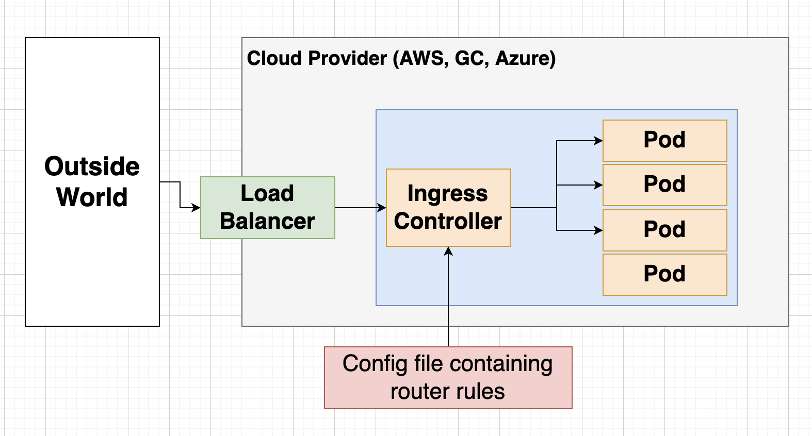

# kubernetes
## Step up
Docker Toolbox
- Prefernces/Kubernetes
- Enable Kubernetes Checkbox

Run
```
Kubectl version
```
1. We user dockerfile to create a docker image for service
2. We create configuraiton file for Kubernetes
   1. Please create 2 copies of service
   2. Make them accesible to other part of cluster
   3. Kubernetes first look on local machine and see if the copy of image exist otherwise go to dockerhub
   4. Create 2 container in the pod and distrubute in a Node
      1. [Node [Pod2[Container1]]] [Node [Po2[Container2]]] 
      2. Pod can have multiple contianer
   5. Kubernetes create deployment, and it is responsible for managing the pods, if they crash run them again
   6. Kubernetes create service, to make the pods available with other nodes in the cluster

# Kubernetes Terminology
- **Cluster**: collection of Nodes + Master to manage them
- **Node**: virtual machine that run our containers
- **Pod**: 1 or more running container
- **Deployment**: Monitor set of pods and guarantee high availablities
- **Service**: Provide easy-url to access to running pods and container in them


# Ingeress Nginx

[Ingeress Nginx](https://kubernetes.github.io/ingress-nginx/)
```
sudo vi /etc/host
```
add
```
127.0.0.1 liveEventManager.dev
```

Know we can access 
```
https://liveeventmanager.dev/api/users/currentuser
```
By default Ingress Ingex use Self Sign Certificate
Type
```
thisisunsafe
```

# Deployment
- Create an image
docker build -t btabe0914/live-cms-server:0.0.1 .

- Create Pod out of Image
```
cd infra/k8s/
kubectl apply -f live-cms-server.depl.yaml
==> 
deployment.apps/live-cms-server-depl configured
service/live-cms-server-srv configured
```
To inspect
```
kubectl get pods
```

# Useful docker commands
docker build -t btabe0914/live-cms-server:0.0.1 . (-t --> tag)
docker run [image id or tag] --> create and start the container
docker run -it [image id or tag] --> create and start container
docker ps --> print all running contianers
docker exec -ti [container id][cmd] --> Execute current command in container
docker logs [container id]

# k8s equvaliant
kubectl get pods --> running pods
kubectl exec -ti [pod_name][cmd e.g sh] --> execute a command in a pod 
kubectl logs [pod_name] 
kubectl delete pod [pod_name]k log 
kubectl apply -f [config file name] --> tell kubernetes to process the config
kubectl describe pod [pod_name]

# create aliase
```
code ~/ .zshrc 
```
add
```
alias k="kubectl"
```
Now you can do
```
k get pods
```

# k8s Deployment
k get deployments
k describe deployment [name of deployment]
k delete deployment [name of deployment]

# Push to Dockerhub
```
docker push btabe0914/live-cms-server
```
Check [Dockerhub](https://hub.docker.com/)

# Restart Deployment
```
k rollout restart deployment live-cms-server-depl
```
--> new pod is created
```
k logs [pod-name] --> to see log
```
# Type of Service
**Cluster IP** Easy remember URL to access Pod. only expose Pod in cluster
**Node Port** Make Pod accessible outside of cluster only for dev
**Load Balancer** Make Pod accessible from outside of cluster
**External Name** Redirect an in cluster request to a CNAME url

# Service Commands
k get services
k get descrive service [service-name] --> to see cluster and external IP

# Load Balancer
Request --> LB --> [Cluster IP][Pod]
- Load Balancer Service: Tell kubernetes to reach out to its provider and provistion a laod balancer, Gets traffic in to a single pod, this LB will be outside of cluster in AWS or Azure or GC, for that we need to have a LB config files.
  
- Ingress: A pod with a set of routing rules to distribute traffic to other services.
  


Ingress will have set of routing rules to pass the request to Pods


# ingress-nginx
Create a Load Balancer + Ingress for us

[Documentation](https://kubernetes.github.io/ingress-nginx/)

## Installation
```
kubectl apply -f https://raw.githubusercontent.com/kubernetes/ingress-nginx/controller-v1.1.0/deploy/static/provider/cloud/deploy.yaml
```
This will include config for Ingress controller and Load Balancer

Now we need to create a config file ingress-srv.yaml
and feed it to cluster, ingress conrtoller will automatically find this config and use its routing and other rule

## Ingress Yaml
Host:
add host live-event-manager.dev and add the role to sudo vi /etc/local
127.0.0.1 live-event-manager.dev
```
k apply -f ingress-srv.yaml
```

# Skaffold
[Documentation](https://skaffold.dev/)

The normal way of deploying the code on production
1. deployment should have latest tag in pod section
2. Make change to your code
3. Build Image
4. Push Image to docker hub
5. k rollout restart deployment [depl_name]

In Dev we can use Skaffold
### Benefits
1. AUtomate task for kubernetes dev
2. Easy to update code on running pod
3. Easy to create/delete all objects tied to project

[Installation](https://skaffold.dev/docs/install/)

```
skaffold dev
```

skaffold push the new changes to pod but we still need something like
```
  "start": "ts-node-dev --poll src/index.ts"
```
To rebuild the app


# Generic Secret
Create JWT_KEY as secret on Kubernetes
And we can load it to all the Pods as Env Variables
```
kubectl create secret generic jwt-secret --from-literal=JWT_KEY=[Your Secret]
```
```
kubectl get secrets
```

We can now add the secret to the pod config
```
 - name: JWT_KEY
              valueFrom:
                secretKeyRef:
                  name: jwt-secret
                  key: JWT_KEY
```

# Clean up
Skaffold dev can cause issue after multiple running, we need to clean up our system once in a while.

Clean up docker
```
docker system prune
```

Get the name space
```
k get namespaces
```

```
default, ingress-nginx
```

Delete Evicted pods
```
kubectl get pod -n POD_NAME | grep Evicted | awk '{print $1}' | xargs kubectl delete pod -n POD_NAME
```


k get pods -n ingress-nginx
k logs ingress-nginx-controller-54bfb9bb-hv68s -n ingress-nginx -f


kubectl get svc ingress-nginx-controller -n ingress-nginx

k get pods
k get services
k describe srv service_name